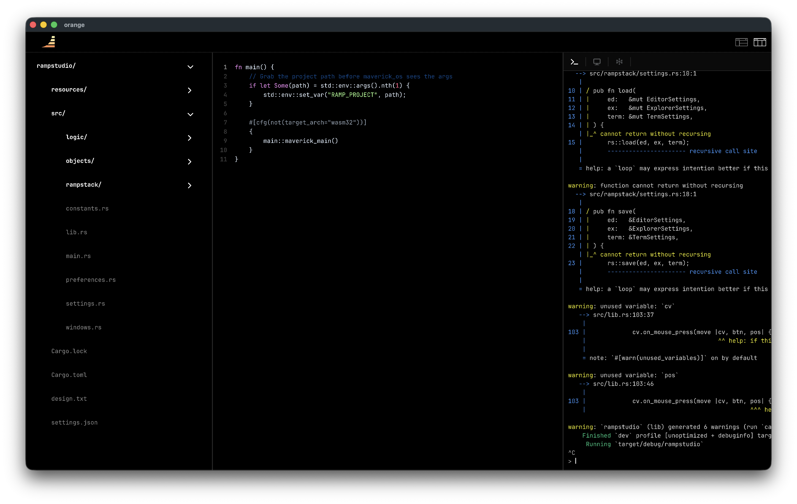

# RampStack

> A fullscreen code editing IDE built on the Quartz framework — composing editor, explorer, and terminal into one fluid workspace.



---

## Overview

RampStack wires three external crates — **editor**, **explorer**, and **terminal** — into a single, cohesive application with a resizable panel layout. Two layout modes keep you in flow whether you prefer everything side-by-side or a stacked terminal beneath your code.

Panel dividers are draggable. Settings persist automatically to `settings.json`.

---

## Layout Modes

### Side-by-Side
```
┌──────────┬──────────────────────┬──────────────┐
│          │                      │              │
│ Explorer │        Editor        │   Terminal   │
│          │                      │              │
└──────────┴──────────────────────┴──────────────┘
```

### Stacked
```
┌──────────┬──────────────────────┐
│          │        Editor        │
│ Explorer ├──────────────────────┤
│          │       Terminal       │
└──────────┴──────────────────────┘
```

Toggle between modes using the icons in the top-right of the toolbar.

---

## Getting Started

### Prerequisites

- Rust toolchain (stable)
- The `quartz` runtime

### Running

```bash
# Open the current directory as the project root
cargo run

# Open a specific project
cargo run -- /path/to/your/project
```

The first CLI argument is read in `main.rs` and written to the `RAMP_PROJECT` environment variable, which `rampstack::project::resolve_project_root()` picks up at runtime. If the variable is unset or empty, the root falls back to `.`.

On launch, RampStack attempts to open a sensible initial file in this order:

```
src/main.rs → src/lib.rs → main.rs → lib.rs → README.md → readme.md → index.js → index.ts
```

If none of those exist, it opens the first file discovered by `read_dir`. If the directory is empty, no file is opened.

### Using RampStack inside a Quartz project

RampStack is itself a Quartz application. Its `App::new` returns a `Scene` and the entry point is declared with `ramp::run!`. If you want to embed or extend it inside your own Quartz project, the integration points are the same ones Quartz exposes everywhere.

**Booting the app**

```rust
// src/main.rs — always exactly this shape
fn main() {
    if let Some(path) = std::env::args().nth(1) {
        std::env::set_var("RAMP_PROJECT", path);
    }
    maverick_main();
}
```

**Canvas setup in `lib.rs`**

RampStack creates its `Canvas` in `Fullscreen` mode so it fills the window at 1:1 scale — no virtual-resolution letterboxing.

```rust
use quartz::{Canvas, CanvasMode};

let mut cv = Canvas::new(ctx, CanvasMode::Fullscreen);
```

**Reading canvas size for layout**

Because there is no fixed virtual resolution in `Fullscreen` mode, all panel geometry is derived from the live canvas size each tick:

```rust
cv.on_update(move |cv| {
    let (cw, ch) = cv.canvas_size();
    // ratio_a, ratio_b, ratio_c are canvas vars — read them typed
    let ratio_a = cv.get_f32("ratio_a");
    let explorer_w = cw * ratio_a;
    // ... reposition panels
});
```

**Storing layout state as canvas vars**

Panel ratios and drag state are stored as Quartz canvas variables so they are accessible from any callback without extra shared state:

```rust
cv.set_var("ratio_a",    Value::from(0.18_f32));
cv.set_var("ratio_b",    Value::from(0.72_f32));  // 1.0 - terminal ratio
cv.set_var("ratio_c",    Value::from(0.60_f32));
cv.set_var("drag_which", Value::from(0_u8));
cv.set_var("layout_mode",Value::from(0_u8));

// Read them back anywhere with the typed getter
let mode = cv.get_u8("layout_mode");
```

**Wiring mouse input**

Divider dragging and layout-mode toggling are driven by the three standard Quartz mouse callbacks:

```rust
cv.on_mouse_press(move |cv, _btn, (mx, my)| {
    logic::windows_obj::on_press(cv, mx, my);
});
cv.on_mouse_release(move |cv, _btn, _pos| {
    logic::windows_obj::on_release(cv);
});
cv.on_mouse_move(move |cv, (mx, my)| {
    logic::windows_obj::on_move(cv, mx, my);
});
```

**Repositioning panels every tick**

`logic::windows_obj::update` is called once per tick from `on_update`. It returns a `Panels` struct with the current `(x, y, w, h)` of each panel, which is forwarded straight to the three crate components:

```rust
cv.on_update(move |cv| {
    // keep min_explorer in sync with the explorer crate's preference
    let min_w = ex_settings.get().min_width;
    cv.set_var("min_explorer", Value::from(min_w));

    let panels = logic::windows_obj::update(cv);

    ex_resize(panels.explorer);
    editor.set_bounds(panels.editor);
    term_settings.get_mut().offset_x = panels.terminal.0;
    term_settings.get_mut().offset_y = panels.terminal.1;
});
```

---

## Configuration

All settings are persisted to `settings.json` in the working directory. The file is created automatically on first launch with sensible defaults.

The file contains three sections — `editor`, `explorer`, and `terminal` — which store panel-specific preferences including fonts, colors, and layout behavior.

You rarely need to edit this file by hand; all settings are written back automatically as you use the app.

---

## Panel Layout & Dividers

| Canvas Variable | Type  | Description |
|-----------------|-------|-------------|
| `ratio_a`       | `f32` | Explorer right edge as a fraction of canvas width |
| `ratio_b`       | `f32` | Editor right edge (side-by-side mode) |
| `ratio_c`       | `f32` | Editor bottom edge as a fraction of panel height (stacked mode) |
| `drag_which`    | `u8`  | `0` = none · `1` = dragging divider A · `2` = dragging divider B/C |
| `layout_mode`   | `u8`  | `0` = side-by-side · `1` = stacked |

Dividers snap to minimum panel widths and cannot be dragged beyond the bounds of adjacent panels.

---

## Project Structure

```
rampstack/
├── src/
│   ├── lib.rs                  # App entry, panel orchestration
│   ├── main.rs                 # CLI arg parsing, env setup
│   ├── constants.rs            # INIT_* layout constants
│   ├── preferences.rs          # Colors, topbar height, file paths
│   ├── objects/
│   │   └── windows_obj.rs      # Chrome GameObjects setup
│   ├── logic/
│   │   ├── windows_obj.rs      # Divider drag, layout toggle, panel update
│   │   └── settings.rs         # Load/save wrappers
│   └── rampstack/
│       ├── project.rs          # Project root resolution, initial file pick
│       ├── settings.rs         # Serialize/parse settings.json
│       └── windows.rs          # Shared panel types, divider helpers
├── resources/
│   ├── studio.png              # IDE screenshot (this README's header)
│   ├── rampstacklogo.png       # Topbar logo
│   ├── cobalt.tmTheme          # Preferred syntax theme
│   ├── dark-rust.tmTheme       # Fallback syntax theme
│   ├── JetBrainsMono-Bold.ttf
│   ├── JetBrainsMono-Regular.ttf
│   ├── fa-solid-900.ttf
│   ├── selected_sidebyside.png
│   ├── unselected_sidebyside.png
│   ├── selected_stacked.png
│   └── unselected_stacked.png
└── settings.json               # Written at runtime
```

---

## Architecture

RampStack follows a clean objects / logic separation:

- **`objects/`** — pure construction. Each file has a `setup()` function that builds GameObjects. No event handling, no `on_update`.
- **`logic/`** — behaviour. Handles mouse input, drag state, panel recalculation, and settings I/O.
- **`rampstack/`** — shared internals. Types, serialization helpers, project resolution.

The main update loop in `lib.rs` calls `logic::windows_obj::update()` every tick to get fresh `Panels` bounds, then forwards those bounds to the editor, explorer, and terminal components.

---

## Fonts & Themes

| Asset | Use |
|-------|-----|
| `JetBrainsMono-Bold` | Gutter line numbers, explorer labels |
| `JetBrainsMono-Regular` | Editor code, terminal output |
| `fa-solid-900` (FontAwesome) | Explorer file-type icons |
| `cobalt.tmTheme` | Primary syntax highlighting theme |
| `dark-rust.tmTheme` | Fallback if cobalt is unavailable |
